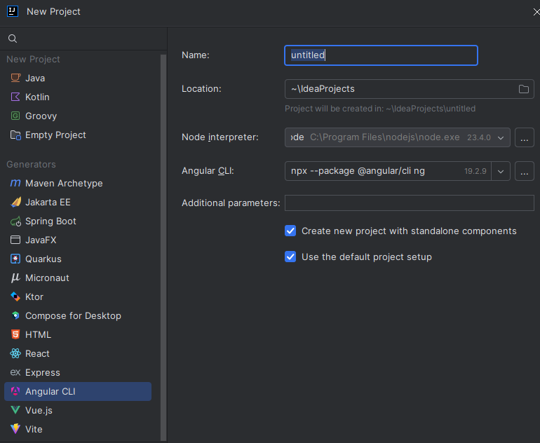
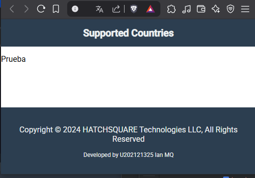
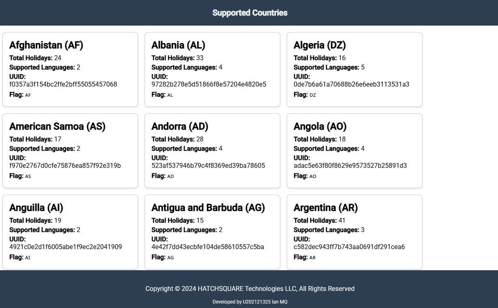

# Guía de Desarrollo para la PC1 de Open Source (SI729)

## Indice
   
  - [Enunciado : Caso HATCHSQUARE Technologies LLC.](#enunciado-)
  - [Restricciones técnicas:](#restricciones-técnicas)
    - [Requirimientos del Equipo](#requirimientos-del-equipo)
    - [Fuera del alcance](#fuera-del-alcance-)
    - [Referencias](#referencias-)
    - [Calificación](#calificación)
  - [Guía de Desarrollo:](#guía-de-desarrollo)
    - [Primeros pasos](#primeros-pasos)
    - [Orden de Carpetas](#orden-de-carpetas)
    - [Creación de Componentes](#creación-de-componentes)
      - [Header y Footer](#header-y-footer-)
      - [Countries Services](#countries-services)
      - [Countries Entity](#countries-entity)
      - [Countries Component](#countries-component)
  - [Correción de errores](#correción-de-errores)


## Enunciado 

Caso HATCHSQUARE Technologies LLC.  

Su cliente, Hatchsquare Technologies, LLC. Desea promover el uso de su plataforma 
Calendarific (https://calendarific.com/), un RESTful API de alcance mundial, fácil de 
usar para desarrolladores que brinda acceso a celebraciones y días festivos públicos, 
locales y bancarios; abarca más de 230 países, más de 3300 estados y más de 100 idiomas.   

Para ello, le solicita elaborar una aplicación web que obtenga la información de los países 
(countries) para los posee información, accediendo 
al endpoint:  https://calendarific.com/api/v2/countries  
La documentación del API se encuentra en: https://calendarific.com/api-documentation  

Para el desarrollo web de lado web frontend, se ha seleccionado TypeScript como lenguaje de 
programación y Angular como Frontend Framework.  Se le encarga el desarrollo de una 
aplicación web que implemente las siguientes características: 

- La aplicación debe presentar en la parte superior un Toolbar, 
con el título “Supported Countries” 

- La aplicación debe presentar como vista por defecto un conjunto de cards donde para 
cada card presente la información disponible para el país (country), incluyendo 
country name, iso-3166, total holidays, supported languages, uuid, flag unicode.  

- La aplicación debe presentar en la parte inferior, una sección de footer con la 
información “Copyright © 2024 HATCHSQUARE Technologies LLC, All rights reserved.” 
en la primera línea. Además debe incluir en la segunda línea del footer la 
información “Developed by“ y los datos del Developer (considérese 
a usted como autor, indicando código, nombre y apellido.)

El equipo de IT de su cliente tomará en cuenta no sólo el cumplimiento de las 
características funcionales, sino el diseño de interfaz de usuario, así como la 
estructura del proyecto, aplicación de convenciones de nomenclatura de objetos de 
programación en inglés, convenciones de nomenclatura de Angular, organización y 
eficiencia del código. Igualmente se tomará en cuenta la aplicación de patrones 
de diseño. Se toma en cuenta accessibility (imágenes con texto alternativo, uso de 
ARIA attributes) y usability. 

## Restricciones técnicas:

### Requirimientos del Equipo:

- Interfaz de usuario basada en Angular Material, mientras que para la 
comunicación con el backend debe apoyarse en HttpClient 
(incluido en @angular/common/http). 
- Debe incluir ARIA atributes en las vistas. 
- La interfaz de usuario debe mostrar los textos en inglés. 
- El proyecto de aplicación debe poder aperturarse sin problemas en JetBrains WebStorm.

### Fuera del alcance: 
- Sidebar 
- Internationalization 
- Routing 

### Referencias: 
- https://calendarific.com/  
- https://angular.io/guide/http 
- https://material.angular.io/components/toolbar/overview  
- https://material.angular.io/components/toolbar/overview#accessibility 
- https://material.angular.io/components/grid-list/overview 
- https://material.angular.io/components/grid-list/overview#accessibility 
- https://material.angular.io/components/card/overview 
- https://material.angular.io/components/card/overview#accessibility  
- https://www.w3.org/TR/wai-aria/#usage   

### Calificación:

| Criterio de Calificación  | Requisitos                                                                                                                                                                                                                                                                                                                                                                                                                                                                                                                                                                                                                                                                                          | Puntaje |
|---------------------------|-----------------------------------------------------------------------------------------------------------------------------------------------------------------------------------------------------------------------------------------------------------------------------------------------------------------------------------------------------------------------------------------------------------------------------------------------------------------------------------------------------------------------------------------------------------------------------------------------------------------------------------------------------------------------------------------------------|---------|
| C01. Building y ejecución | Al abrir el proyecto y ordenar la ejecución, ésta se inicia sin problemas. La aplicación es accesible en la ruta indicada.                                                                                                                                                                                                                                                                                                                                                                                                                                                                                                                                                                          | 2.0     |
| C02. User Interface       | Se evidencia que la interfaz de usuario aplica Responsive Web Design. La interfaz cumple con las características solicitadas para la estructura, elementos de la interfaz de usuario.                                                                                                                                                                                                                                                                                                                                                                                                                                                                                                               | 3.0     |
| C03. Features             | La vista cumple de forma completa con los requisitos de interfaz de usuario, con todas las características y restricciones indicadas en el enunciado. Se cumple que la información es recuperada desde el endpoint solicitado.                                                                                                                                                                                                                                                                                                                                                                                                                                                                      | 7.0     |
| C04. Code Organization    | El desarrollador organiza el código y los elementos de frontend de la solución, aplicando buenas prácticas de TypeScript y Angular, agrupando los elementos de la solución según convenciones, manteniendo organización de paquetes y carpetas recomendadas por el fabricante y buenas prácticas de la industria de software, bajo un enfoque domain-driven, cumpliendo con las restricciones técnicas sobre organización.                                                                                                                                                                                                                                                                          | 3.0     |
| C05. Code Quality         | Utiliza para el frontend el lenguaje de programación TypeScript, el framework Angular y cumple con las restricciones técnicas indicadas. La codificación tiene un estilo claro, indentando los bloques de código según los estándares de programación correspondientes al lenguaje, aplicando una lógica consistente en los métodos, condicionales sin escenarios no contemplados, uso adecuado de reutilización de código para evitar redundancia. Aplica patrones de arquitectura y patrones de diseño. Distribuye el código en los niveles correspondientes, asignando lógica de persistencia, lógica de negocio, lógica de control, y transferencia a las interfaces y clases que corresponden. | 3.0     |
| C06. Naming Standards     | El desarrollador aplica en todos los nombres de objetos de programación como paquetes, componentes, interfaces, clases, objetos, variables, constantes y métodos la nomenclatura en inglés y la nomenclatura estándar para identificadores de clases, objetos, miembros de programación, así como los recursos.                                                                                                                                                                                                                                                                                                                                                                                     | 2.0     |

## Guía de Desarrollo:

### Primeros pasos

Para el desarrollo de este proyecto usaremos JetBrains WebStorm, un IDE para JavaScript y 
TypeScript.

Por lo que comenzaremos creando un proyecto nuevo en WebStorm, seleccionando la opción de 
Angular y TypeScript.



Con el proyecto creado, procederemos a instalar Angular Material. Para ello, abrimos la 
terminal de WebStorm y ejecutamos el siguiente comando:

```bash 
ng add @angular/material
```
Luego de ejecutar el comando, se nos presentará una serie de opciones para configurar 
Angular Material. Seleccionamos las opciones que mejor se adapten a nuestro proyecto. 
En este caso, seleccionaremos la opción de tema predefinido y la opción de incluir animaciones.

```bash
✔ Choose a prebuilt theme name, or "custom" for a custom theme: [your choice] 
✔ Set up global Angular Material typography styles? Yes
```
### Orden de Carpetas

La estructura de carpetas del proyecto debe seguir un orden lógico y organizado. 
A continuación, se presenta una posible estructura de carpetas:

```
src
├── app
│   ├── countries
│   ├── public
│   └── shared
└── enviroments    
```
### Creación de Componentes
Para crear los componentes necesarios para el proyecto, utilizaremos el comando `ng g c` que 
es lo mismo que `ng generate component` de Angular CLI. 

#### Header y Footer 
A continuación, crearemos los componentes más sencillos:

```bash
>>Click derecho en public
>>Open in terminal

ng g c header
ng g c footer
```

Ahora nos dirigimos a app.component.html, borramos su contenido y agregamos los componentes creados:

```html
<app-header></app-header>

<app-footer></app-footer>
```

Luego de crearlos nos daremos que un problema que afecta a nuestros componentes es el siguiente:
```bash
Only standalone components can use imports
```
Por lo que para resolverlo debemos irnos a los archivos header.component.ts y footer.component.ts y
agregar la propiedad `standalone: true` en el decorador `@Component`. 
```typescript
//Ejemplo footer.component.ts
@Component({
  selector: 'app-footer',
  imports: [],
  templateUrl: './footer.component.html',
  standalone: true, //<-- Agregar esta línea
  styleUrl: './footer.component.css'
})
export class FooterComponent {
  constructor() { }
}
```

Seguido de esto nos dirigimos a `app.component.ts` y hacemos unos cambios para que pueda funcionar
correctamente el header y footer. 
```typescript
//Lineas a agregar
import {HeaderComponent} from './public/header/header.component';
import {FooterComponent} from './public/footer/footer.component';

imports: [RouterOutlet, HeaderComponent, FooterComponent]
```

Con los componentes conectados, solo quedaría darle un diseño a ambos componentes.



Para conseguir este resultado se modificaron:

```html
[ header.component.html ]

<mat-toolbar color="primary">
  <span>Supported Countries</span>
</mat-toolbar>
```
```
[ header.component.css  ]

mat-toolbar {
background-color: #2c3e50; /* Mismo color de fondo que el footer */
color: #ecf0f1; /* Mismo color de texto que el footer */
font-size: 20px;
font-weight: bold;
justify-content: center;
}
```

```html
[ footer.component.html ]

<footer class="footer">
  <div class="footer-content">
    <p>
      Copyright &copy; 2024 HATCHSQUARE Technologies LLC, All Rights Reserved
    </p>
    <p class="footer-copyright">Developed by U202121325 Ian MQ</p>
  </div>
</footer>
```
```
[ footer.component.css ]
.footer {
background-color: #2c3e50;
color: #ecf0f1;
padding: 20px 0;
text-align: center;
}

.footer-content {
max-width: 1200px;
margin: 0 auto;
padding: 0 15px;
}

.footer-nav {
margin-bottom: 10px;
}

.footer-nav a {
color: #ecf0f1;
text-decoration: none;
margin: 0 10px;
font-size: 14px;
}

.footer-nav a:hover {
text-decoration: underline;
}

.footer-copyright {
font-size: 12px;
margin-top: 10px;
}
```

```html
[ app.component.html ]

<app-header></app-header>
<main>
  
</main>
<app-footer></app-footer>
```
```
[ app.component.css ]
html, body {
  height: 100%;
  margin: 0;
  display: flex;
  flex-direction: column;
}

app-root {
  display: flex;
  flex-direction: column;
  min-height: 100%;
}

main {
  flex: 1; /* Hace que el contenido principal ocupe el espacio restante */
}

app-footer {
  position: sticky; /* Cambia a sticky para que el footer se mantenga en la parte inferior */
  bottom: 0;
  left: 0;
  width: 100%;
  text-align: center; /* Centra el contenido del footer */
}
```
### Countries Services

Para trabajar con la sección Countries, necesitamos establecer ota division en las carpetas.

```
src
├── app
│   ├── countries
│   │   ├── components
│   │   ├── entities
│   │   └── services
...    
└── enviroments  
```

comenzamos por entender la estructura de la API, para ello nos dirigimos a la documentación de la API y
revisamos el endpoint de countries. 
```bash
https://calendarific.com/api-documentation
```
Para nuestro caso, obtendremos nuestar apikey y usaremos el siguiente endpoint
```bash
https://calendarific.com/api/v2/countries?api_key=baa9dc110aa712sd3a9fa2a3dwb6c01d4c875950dc32vs
```
con esto nos vamos a la carpeta enviroments y creamos un archivo llamado `enviroment.ts` dentro de
el agregamos lo siguiente:

```typescript
export const enviroment = {
  production: false,
  api: 'https://calendarific.com/api/v2/countries?api_key=nSOeTmlyh7Gy7Jygj4yQZyyj348LWz70'
}
```

Con esto listo deberiamos darle un vistazo a la estructura en la que viene la información
proveniente de este endpoint:

```json
{
  "meta": {
    "code": 200    
  },
  "response": {
    "url": "https://calendarific.com/supported-countries",
    "countries": [
      {
        "country_name": "Afghanistan",
        "iso-3166": "AF",
        "total_holidays": 24,
        "supported_languages": 2,
        "uuid": "f0357a3f154bc2ffe2bff55055457068",
        "flag_unicode": "🇦🇫"
      }
    ]
  }
}
```
Luego de tener una idea de la estructura de la API, creamos un servicio para poder
obtener la información de los países. Para ello, nos dirigimos a la carpeta `services` y
creamos un archivo llamado `countries.service.ts` y dentro de este agregamos lo siguiente:

```
import { Injectable } from '@angular/core';
import { HttpClient } from '@angular/common/http';
import { enviroment } from 'src/environments/enviroment';

@Injectable({
  providedIn: 'root'
})
export class CountriesService {
  private apiUrl = enviroment.api;

  constructor(private http: HttpClient) { }

  getCountries() {
    return this.http.get<any>(this.apiUrl);
  }
}
```

con esto listo, creamos un archivo dentro de services llamado `countries.service.spec.ts` 
y dentro de este agregamos lo siguiente:

```typescript
import { TestBed } from '@angular/core/testing';
import {CountriesService} from './countries.service';

describe('CountriesService', () => {
  let service: CountriesService;

  beforeEach(() => {
    TestBed.configureTestingModule({});
    service = TestBed.inject(CountriesService);
  });

  it('should be created', () => {
    expect(service).toBeTruthy();
  });
});
```
Para finalizar con el desarrollo de la sección services, necesitamos habilitar el modulo de HttpClient,
para eso nos dirijimos a `app.config.ts` y dentro de este agregamos lo siguiente:

```
import {ApplicationConfig, importProvidersFrom, provideZoneChangeDetection} from '@angular/core';
import { provideRouter } from '@angular/router';

import { routes } from './app.routes';
import { HttpClientModule} from '@angular/common/http';

export const appConfig: ApplicationConfig = {
  providers: [
    provideZoneChangeDetection({ eventCoalescing: true }),
    provideRouter(routes),
    importProvidersFrom(HttpClientModule) // Agregar esta línea
  ]
};
```

### Countries Entity

Con un servicio que nos permita extraer la información de la API, ahora creamos un
entity para poder manejar la información de los países. Para ello, nos dirigimos a la
carpeta `entities` y creamos un archivo llamado `country.entity.ts` y dentro de este:

Para este caso tenemos una versión simplificada de la entidad que funciona si los atributos
son los mismos que los de la API. Lo llamaremos V1 :

```typescript
export class Country {
  country_name: string;
  iso_3166: string;
  total_holidays: number;
  supported_languages: number;
  uuid: string;
  flag_unicode: string;
}
```
Para nuestro caso usaremos una versión más compleja de la entidad, que nos permite 
manejar la información de los países de una forma más flexible y adecuada a la api con la
que trabajamos. Lo llamaremos V2 :

```typescript
export class Country {
  country_name: string;
  iso_3166: string;
  total_holidays: number;
  supported_languages: number;
  uuid: string;
  flag_unicode: string;

  constructor(
    country_name: string = "",
    iso_3166: string = "",
    total_holidays: number = 0,
    supported_languages: number = 0,
    uuid: string = "",
    flag_unicode: string = ""
  ) {
    this.country_name = country_name;
    this.iso_3166 = iso_3166;
    this.total_holidays = total_holidays;
    this.supported_languages = supported_languages;
    this.uuid = uuid;
    this.flag_unicode = flag_unicode;
  }

  // Método estático para mapear un objeto JSON a una instancia de Country
  static fromJson(json: any): Country {
    return new Country(
      json["country_name"] || "",
      json["iso-3166"] || "", //Esta versión considera que el campo puede venir con guiones
      json["total_holidays"] || 0,
      json["supported_languages"] || 0,
      json["uuid"] || "",
      json["flag_unicode"] || ""
    );
  }
}
```
### Countries Component

Por ultimo faltaria crear un componente para poder mostrar la información de los países.
Para ello, nos dirigimos a la carpeta `components` y creamos un componente de la siguiente forma:

```bash
>selecionamos la carpeta countries/components
ng g c country-cards
```

Comenzamos por establecer la estructura del componente, asi que nos dirigimos a
`country-cards.component.ts` y dentro de este agregamos lo siguiente:

Este sería la estructura básica del componente que trabaja con la V1 de la entidad:

```
import {Component, OnInit} from '@angular/core';
import {CountriesService} from '../../services/countries.service';
import {DecimalPipe, NgForOf} from '@angular/common';
import {Country} from '../../entities/country.entity';

@Component({
  selector: 'app-country-cards',
  templateUrl: './country-cards.component.html',
  imports: [
    DecimalPipe,
    NgForOf
  ],
  standalone: true,
  styleUrl: './country-cards.component.css'
})
export class CountryCardsComponent implements OnInit {
  data: Country[] = [];

  constructor(private countriesService: CountriesService) {}

  ngOnInit() {
    this.getCountries();
  }

  private getCountries() {
    this.countriesService.getCountries().subscribe(
      (result ) => {
        this.data = result.response.countries;
      },
      (error) => {
        console.error('Error fetching countries:', error);
      }
    );
  }
}
}
```
Para trabajar con la V2 de la entidad tendriamos que hacer un ligero cambio dentro del componente:
```
private getCountries() {
    this.countriesService.getCountries().subscribe(
      (result ) => {
        this.data = result.response.countries.map((json: any) => Country.fromJson(json));
      },
      (error) => {
        console.error('Error fetching countries:', error);
      }
    );
    }
```
Con esto listo, ahora nos dirigimos a `country-cards.component.html` y dentro de este
agregamos lo siguiente:

```
<div class="cards-container">
  <div class="card" *ngFor="let country of data">
    <h2>{{ country.country_name }} ({{ country.iso_3166 }})</h2>
    <p><strong>Total Holidays:</strong> {{ country.total_holidays }}</p>
    <p><strong>Supported Languages:</strong> {{ country.supported_languages }}</p>
    <p><strong>UUID:</strong> {{ country.uuid }}</p>
    <p><strong>Flag:</strong> {{ country.flag_unicode }}</p>
  </div>
</div>
```
Los estilos para el componente se encuentran dentro de `country-cards.component.css` y esos
van a discreción del desarrollador, pero para conseguir un resultado similar al de la imagen
se recomienda usar lo siguiente:



```
.cards-container {
  display: flex;
  flex-wrap: wrap;
  gap: 16px;
  padding: 16px;
}

.card {
  border: 1px solid #ccc;
  border-radius: 8px;
  padding: 16px;
  width: 300px;
  box-shadow: 0 2px 4px rgba(0, 0, 0, 0.1);
  background-color: #fff;
}

.card h2 {
  margin: 0 0 8px;
}

.card p {
  margin: 4px 0;
}
```
Por ultimo tendriamo que agregar nuestro componente dentro de `app.component.html` para que
pueda ser visualizado, por lo que nos dirigimos a `app.component.html` y dentro de este
agregamos lo siguiente:

```
<app-header></app-header>
<main>
  <app-country-cards></app-country-cards>
</main>
<app-footer></app-footer>
```

Con esto listo ya tendríamos una aplicación funcional que muestra la información de los países
soportados por la API de Calendarific.

Debido a que este es un examen del año pasado y no cuento con un profesor que lo califique, no puedo
asegurar que la calificación sea correcta. Sin embargo, he seguido las instrucciones y he tratado de
hacerlo lo mejor posible. Si tienes alguna duda o necesitas ayuda, no dudes en preguntar. Aunque no
pienso si al menos tener una calificación, por lo que, asistido por la IA, he llegado a la siguiente
calificación:

| **Criterio de Calificación**  | **Puntaje Estimado** | **Comentarios**                                                                                                                                                                               |
|-------------------------------|----------------------|-----------------------------------------------------------------------------------------------------------------------------------------------------------------------------------------------|
| **C01. Building y ejecución** | **2.0/2.0**          | El proyecto parece estar correctamente configurado y funcional, con instrucciones claras para la instalación y ejecución.                                                                     |
| **C02. User Interface**       | **2.5/3.0**          | La interfaz cumple con los requisitos básicos, pero podría mejorar en términos de diseño responsivo y accesibilidad (uso de ARIA attributes).                                                 |
| **C03. Features**             | **6.5/7.0**          | Se cumplen los requisitos funcionales principales, pero se podría mejorar la validación de datos y la gestión de errores en el servicio.                                                      |
| **C04. Code Organization**    | **2.5/3.0**          | La organización del código es buena, pero podría beneficiarse de una mayor separación de responsabilidades y modularidad en algunos componentes.                                              |
| **C05. Code Quality**         | **2.5/3.0**          | El código es claro y sigue buenas prácticas, pero podría incluir más comentarios, pruebas unitarias adicionales y validaciones en el constructor o método `fromJson` de la entidad `Country`. |
| **C06. Naming Standards**     | **2.0/2.0**          | Los nombres de clases, métodos y variables están en inglés y siguen las convenciones de nomenclatura estándar.                                                                                |

**Puntaje Total Estimado: 18.0/20.0**

| **Área de Mejora**                        | **Descripción**                                                                                                                                                                          |
|-------------------------------------------|------------------------------------------------------------------------------------------------------------------------------------------------------------------------------------------|
| **Accesibilidad (C02)**                   | Agregar atributos ARIA en los componentes, como en los botones, encabezados y elementos interactivos. Asegurarse de que las imágenes tengan texto alternativo (`alt`).                   |
| **Diseño Responsivo (C02)**               | Mejorar el diseño para dispositivos móviles utilizando Angular Material Grid o Flex Layout. Asegurarse de que las tarjetas se ajusten correctamente en pantallas pequeñas.               |
| **Gestión de Errores (C03)**              | Implementar mensajes de error más detallados en el componente `CountryCardsComponent` para manejar fallos en la API. Mostrar un mensaje amigable al usuario si no hay datos disponibles. |
| **Validación de Datos (C05)**             | Agregar validaciones en el constructor o método `fromJson` de la clase `Country` para garantizar que los datos sean válidos antes de asignarlos.                                         |
| **Pruebas Unitarias (C05)**               | Incluir pruebas unitarias para el componente `CountryCardsComponent` y la clase `Country` para verificar que los datos se procesen correctamente.                                        |
| **Separación de Responsabilidades (C04)** | Dividir la lógica de transformación de datos (como `fromJson`) en un servicio separado para mantener la entidad más limpia.                                                              |


## Correción de errores

Header Component
   En el archivo header.component.html, agrega un atributo aria-label al mat-toolbar para describir su propósito.
```
<mat-toolbar color="primary" aria-label="Supported Countries Toolbar">
  <span>Supported Countries</span>
</mat-toolbar>
```
Country Cards Component
   En el archivo country-cards.component.html, agrega atributos ARIA y texto alternativo para mejorar la accesibilidad:
   Usa aria-labelledby para asociar el encabezado (h2) con el contenido de la tarjeta.
   Si incluyes imágenes en las tarjetas, asegúrate de usar el atributo alt para describirlas.
```
<div class="cards-container">
  <div class="card" *ngFor="let country of data" role="region" aria-labelledby="country-{{ country.iso_3166 }}">
    <h2 id="country-{{ country.iso_3166 }}">{{ country.country_name }} ({{ country.iso_3166 }})</h2>
    <p><strong>Total Holidays:</strong> {{ country.total_holidays }}</p>
    <p><strong>Supported Languages:</strong> {{ country.supported_languages }}</p>
    <p><strong>UUID:</strong> {{ country.uuid }}</p>
    <p><strong>Flag:</strong> <span role="img" aria-label="Flag of {{ country.country_name }}">{{ country.flag_unicode }}</span></p>
  </div>
</div>
```

Footer Component
   En el archivo footer.component.html, agrega un atributo aria-label para describir el propósito del pie de página.
```
<footer class="footer" aria-label="Footer with copyright and developer information">
  <div class="footer-content">
    <p>
      Copyright &copy; 2024 HATCHSQUARE Technologies LLC, All Rights Reserved
    </p>
    <p class="footer-copyright">Developed by U202121325 Ian MQ</p>
  </div>
</footer>
```

Imágenes (si las usas)
Si en algún componente incluyes imágenes, asegúrate de usar el atributo alt para describirlas. Por ejemplo:

```

```

## Cambiar idioma

Para cambiar el idioma de la aplicación, puedes usar Angular i18n o una biblioteca como ngx-translate. 
Aquí hay un ejemplo básico de cómo hacerlo:

Primero instala ngx-translate:
```bash
npm install @ngx-translate/core @ngx-translate/http-loader
```

Con esto listo, puedes configurar ngx-translate en tu aplicación. Para ello creamos una carpeta donde iran
los archivos de traducción, por ejemplo `public/i18n/` y dentro de esta creamos dos archivos 
`en.json` y `es.json`. 

```
project
├── public
│   ├── i18n
│   │   ├── en.json
│   │   └── es.json
...    
└── src
```
Ahora nos diirjimos a `app.conifg.ts` y dentro de este agregamos lo siguiente:

```
import {ApplicationConfig, importProvidersFrom, provideZoneChangeDetection} from '@angular/core';
import { provideRouter } from '@angular/router';

import { routes } from './app.routes';
import {HttpClient, HttpClientModule, provideHttpClient} from '@angular/common/http';
import {provideTranslateService, TranslateLoader} from '@ngx-translate/core';
import {TranslateHttpLoader} from '@ngx-translate/http-loader';

const httpLoaderFactory: (http: HttpClient) =>
  TranslateLoader = (http: HttpClient) =>
  new TranslateHttpLoader(http, './i18n/', '.json');

export const appConfig: ApplicationConfig = {
  providers: [
    provideZoneChangeDetection({ eventCoalescing: true }),
    provideRouter(routes),
    importProvidersFrom(HttpClientModule),

    provideHttpClient(),
    provideTranslateService({
      loader: {
        provide: TranslateLoader,
        useFactory: httpLoaderFactory,
        deps: [HttpClient]
      },
      defaultLanguage: 'en',
    })
  ]
};
```
Una vez configurado, para poder usar el servicio de traducción debemos importarlo en el componente
`app.component.ts` y dentro de este agregar lo siguiente:

```
export class AppComponent {
  title = 'si729-ciclo202401-pc1';

  constructor(translate: TranslateService) {
    translate.setDefaultLang('en');
    translate.use('en');
  }
}
```
Con esto listo, ahora podemos usar el servicio de traducción en cualquier componente. Claro que para
cambiar el idioma de la aplicación, debemos agregar un selector para que el usuario pueda elegir el idioma
que desea usar. Para ello, creamos un nuevo componente llamado `language-selector` y dentro de este
agregamos lo siguiente:

```bash
>selecionamos la carpeta app/public/
ng g c language-selector
```
Despues de crearlo, nos dirigimos a `language-selector.component.ts` y dentro de este agregamos lo siguiente:
```
import { Component } from '@angular/core';
import {TranslateService} from '@ngx-translate/core';

@Component({
  selector: 'app-language-selector',
  imports: [],
  templateUrl: './language-selector.component.html',
  standalone: true,
  styleUrl: './language-selector.component.css'
})
export class LanguageSelectorComponent {
  currentLang: string = 'en';
  languages: string[] = ['en', 'es'];

  constructor(private translateService: TranslateService) {
    this.currentLang = this.translateService.currentLang;
  }

  useLanguage(language: string): void {
    this.translateService.use(language);
  }

}
```

Luego nos dirigimos a `language-selector.component.html` y dentro de este agregamos lo siguiente:
```
<div class="language-selector">
  <label for="language-select">Select Language:</label>
  <select id="language-select" [(ngModel)]="currentLang" (change)="useLanguage(currentLang)">
    <option *ngFor="let lang of languages" [value]="lang">{{ lang }}</option>
  </select>
</div>
```


